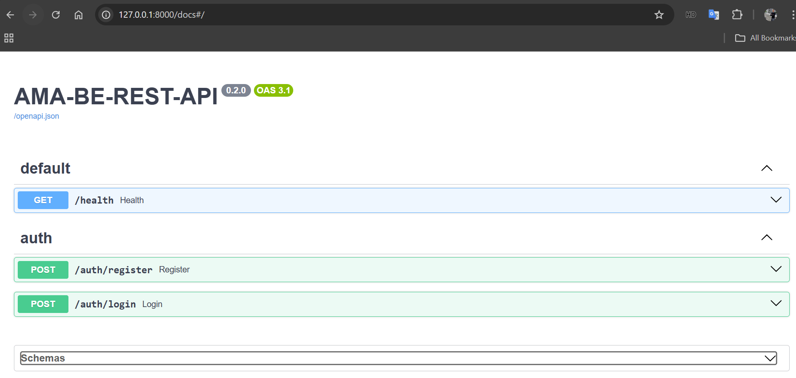

# AMA-BE-REST-API
rest API - example of implementation 

1. API implementation will include most important endpoints (currently /health, /register, /login, /items endpoints are available)
2. Work ongoing on VS Code side
3. README file will be updated according to the new commits and made changes 

Item model (DB table) - CRUD endpoints:
GET /items
POST /items
GET /items/{id}
PUT /items/{id}
DELETE /items/{id}

Alerady done:
- DB setup ->
- User auth (register/login endpoints)
- Token (JWT) implemnted 
- Password hashing added
- Added protected items CRUD endpoints

Swagger
